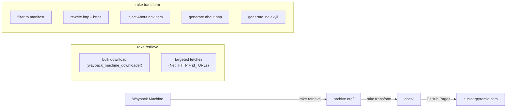

# Task: Static Archive Pipeline for NuclearPyramid.com

* Task ID: nuclear-pyramid-pipeline
* Complexity: Level 3
* Type: Feature (greenfield build pipeline)

Build a Ruby/Rake pipeline that retrieves NuclearPyramid.com from the Internet Archive, transforms it into a clean static site, and outputs to `docs/` for GitHub Pages.

## Pinned Info

### Site File Manifest

Every file that must exist in `docs/` to serve the complete site. This is the **authoritative list** — nothing outside this list gets published.

**Pages (HTML served as .php):**
| File | Source | Notes |
|---|---|---|
| `index.php` | `archive.org/index.php` | Homepage, exists on disk |
| `great_pyramid.php` | Wayback `20160305172515` | Targeted fetch (on-disk version is junk) |
| `other_two_pyramids.php` | Wayback `20160322015445` | Targeted fetch (on-disk version is junk) |
| `proton.php` | Wayback `20160324003324` | Targeted fetch (on-disk version is junk) |
| `energy_solution.php` | `archive.org/energy_solution.php` | Exists on disk (commented out in nav but real content) |
| `about.php` | Generated | New placeholder page |

**Images — proton.php figures:**
`fig001.jpg`, `fig002.jpg`, `fig004.jpg`, `fig006.jpg`–`fig028.jpg` (26 .jpg files), `fig003.gif`, `fig005.gif`, `nuclides.gif` (29 total — note: fig003 and fig005 are .gif only, no .jpg variants exist)

**Images — great_pyramid.php / other_two_pyramids.php figures:**
| File | Source |
|---|---|
| `greatpyramid/fig001.gif` | Wayback `20160305172515` (on-disk version is fake HTML) |
| `greatpyramid/fig002.gif` | `archive.org/` (exists, real) |
| `greatpyramid/fig003.gif` | `archive.org/` (exists, real) |

**Images — energy_solution.php figures:**
`energy/1.png`, `energy/2.gif` through `energy/7.gif` (7 files, all exist on disk)

**Other assets:**
| File | Source |
|---|---|
| `np_logo.gif` | `archive.org/` (exists, real) |
| `From Gravitons to Galaxies.docx` | `archive.org/` (exists, real) |

**Meta files:**
| File | Source |
|---|---|
| `.nojekyll` | Generated (empty file, disables Jekyll on GH Pages) |

**Excluded (not served):**
- `book.htm`, `book_files/` — HTML book version, not linked from index
- `proton_forum/` — phpBB forum, non-functional without DB
- `index.html`, `gr=/`, `__qdcc6fb03fbe5/` — domain-parker redirects
- `toolbar.php`, `cpx.php`, `medios1.php`, `check_image.php` — ad/tracking infra
- `js/general.js` — ad/tracking script
- `robots.txt` — disallows junk files (not useful for the archive)

### Pipeline Flow

## Component Analysis

### Affected Components
- **Gemfile** (new): Declares `wayback_machine_downloader_straw`, `rake`, `minitest`
- **Rakefile** (new): Task definitions wiring retrieval and transform
- **lib/transform.rb** (new): Transform logic — manifest filtering, link rewriting, nav injection, about page generation
- **lib/retrieve.rb** (new): Retrieval logic — targeted Wayback fetches via Net::HTTP
- **test/transform_test.rb** (new): Unit tests for transform logic
- **docs/** (new): Generated output directory

### Cross-Module Dependencies
- `Rakefile` → `lib/retrieve.rb`: `retrieve` tasks invoke retrieval functions
- `Rakefile` → `lib/transform.rb`: `transform` task invokes transform functions
- `lib/transform.rb` reads from `archive.org/`, writes to `docs/`
- `lib/retrieve.rb` writes to `archive.org/`

### Boundary Changes
None — greenfield project.

## Open Questions

None — implementation approach is clear. The file manifest is fully defined, the Wayback snapshot URLs are confirmed working, and the transform operations (filter, rewrite, inject) are straightforward string processing.

## Test Plan (TDD)

### Behaviors to Verify

- **Manifest filtering**: `in_manifest?("index.php")` → true; `in_manifest?("toolbar.php")` → false; `in_manifest?("fig001.jpg")` → true; `in_manifest?("proton_forum/login.php")` → false
- **Link rewriting**: `http://nuclearpyramid.com/foo` → `https://nuclearpyramid.com/foo`; `http://www.nuclearpyramid.com/foo` → `https://nuclearpyramid.com/foo`; `http://nuclearpyramid.com:80/foo` → `https://nuclearpyramid.com/foo`; non-nuclearpyramid URLs unchanged
- **Nav injection**: HTML with existing nav bar → About link added before `</tr></table>`; HTML without nav bar → unchanged
- **About page generation**: Returns valid HTML matching site visual style with placeholder content
- **Binary validation**: Real JPEG → passes; real GIF → passes; HTML disguised as .gif → raises error
- **Full transform**: Given fixture source dir → docs/ contains exactly the manifest files, all HTML files have https links, all HTML files with nav bar have About link

### Test Infrastructure

- Framework: minitest (Ruby stdlib, no extra dependency)
- Test location: `test/`
- Conventions: `test/*_test.rb`, classes named `*Test < Minitest::Test`
- New test files: `test/transform_test.rb`
- Fixtures: `test/fixtures/` with minimal HTML samples

### Integration Tests

- Full transform integration: populate `test/fixtures/archive.org/` with representative files, run transform, verify `test/fixtures/docs/` output

## Implementation Plan

### Phase 1: Project infrastructure
1. **Gemfile**
    - Files: `Gemfile`
    - Changes: Add `wayback_machine_downloader_straw`, `rake`, `minitest`
2. **Bundle install**
    - Run `bundle install` to generate `Gemfile.lock`

### Phase 2: Tests first (TDD)
3. **Test fixtures**
    - Files: `test/fixtures/archive.org/index.php`, `test/fixtures/archive.org/np_logo.gif`, `test/fixtures/archive.org/toolbar.php` (minimal samples)
    - Changes: Create minimal HTML fixtures for testing
4. **Transform tests**
    - Files: `test/transform_test.rb`, `test/test_helper.rb`
    - Changes: Write failing tests for all transform behaviors listed above

### Phase 3: Transform implementation
5. **lib/transform.rb — manifest and filtering**
    - Files: `lib/transform.rb`
    - Changes: `MANIFEST` constant (list of all files to serve), `in_manifest?(path)` method
6. **lib/transform.rb — link rewriting**
    - Files: `lib/transform.rb`
    - Changes: `rewrite_links(html)` method — regex replace http→https for nuclearpyramid.com URLs
7. **lib/transform.rb — nav injection**
    - Files: `lib/transform.rb`
    - Changes: `inject_about_nav(html)` method — insert About link into nav bar
8. **lib/transform.rb — about page**
    - Files: `lib/transform.rb`
    - Changes: `generate_about_page` method — returns HTML matching site style with placeholder content
9. **lib/transform.rb — binary file validation**
    - Files: `lib/transform.rb`
    - Changes: `valid_binary?(path)` method — check magic bytes of image/docx files before copying (JPEG: `\xFF\xD8\xFF`, GIF: `GIF8`, PNG: `\x89PNG`, DOCX/ZIP: `PK`). Raises error if a manifest file has wrong magic bytes (catches fake images like the original greatpyramid/fig001.gif).
10. **lib/transform.rb — build orchestration**
    - Files: `lib/transform.rb`
    - Changes: `build(source_dir, dest_dir)` method — copy manifest files (validating binaries), transform HTML, generate about.php, generate .nojekyll
11. **Run tests — all should pass**

### Phase 4: Retrieval implementation
12. **lib/retrieve.rb — targeted fetches**
    - Files: `lib/retrieve.rb`
    - Changes: `TARGETED_SNAPSHOTS` hash mapping filenames to Wayback `id_` URLs, `fetch_targeted(dest_dir)` method using Net::HTTP
13. **lib/retrieve.rb — bulk download wrapper**
    - Files: `lib/retrieve.rb`
    - Changes: `bulk_download(dest_dir)` method — shells out to `wayback_machine_downloader`

### Phase 5: Rakefile
14. **Rakefile**
    - Files: `Rakefile`
    - Changes: Define tasks `retrieve`, `retrieve:targeted`, `transform`, `build`, `clean`, `test`

### Phase 6: Documentation
15. **README.md update**
    - Files: `README.md`
    - Changes: Document setup, usage (`bundle install`, `rake build`), file manifest, GitHub Pages config instructions

## Technology Validation

- **wayback_machine_downloader_straw** (v2.4.6): Already installed and confirmed working by the user
- **minitest**: Ruby stdlib, no installation needed
- **rake**: Ruby stdlib (bundled with Ruby)
- **Net::HTTP**: Ruby stdlib, used for targeted Wayback fetches via `id_` URLs

No new external technology — validation not required.

## Challenges & Mitigations

- **Wayback `id_` URLs may return unexpected content**: Mitigation — verify fetched content starts with `<` (HTML) or has correct image magic bytes; log warnings for manual review
- **Nav bar pattern varies across pages**: Mitigation — the pattern is confirmed identical across `index.php` and `energy_solution.php`; the targeted-fetched pages (via `id_`) should have the same original HTML nav structure
- **`greatpyramid/fig001.gif` targeted fetch**: Mitigation — fetch from same timestamp as `great_pyramid.php` (20160305172515); verify it's actual GIF data (magic bytes `GIF89a`)
- **`From Gravitons to Galaxies.docx` has a space in filename**: Mitigation — ensure copy/serve handles spaces; GitHub Pages serves files with spaces via URL encoding

## Status

- [x] Component analysis complete
- [x] Open questions resolved (none identified)
- [x] Test planning complete (TDD)
- [x] Implementation plan complete
- [x] Technology validation complete
- [x] Preflight (PASS)
- [ ] Build
- [ ] QA
